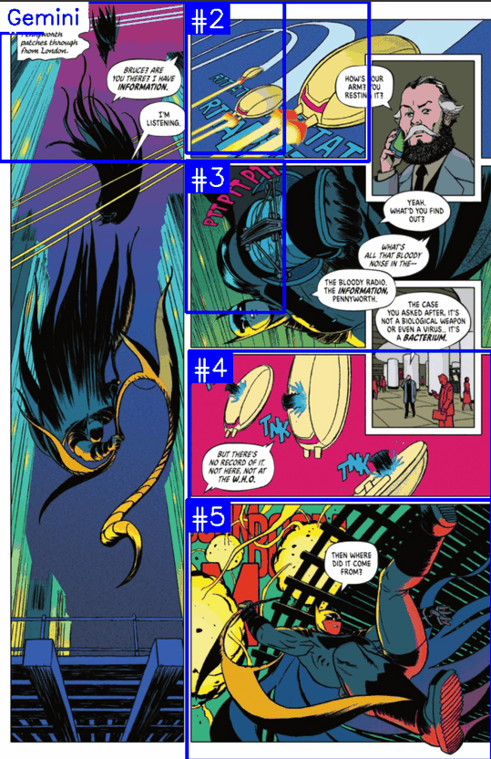
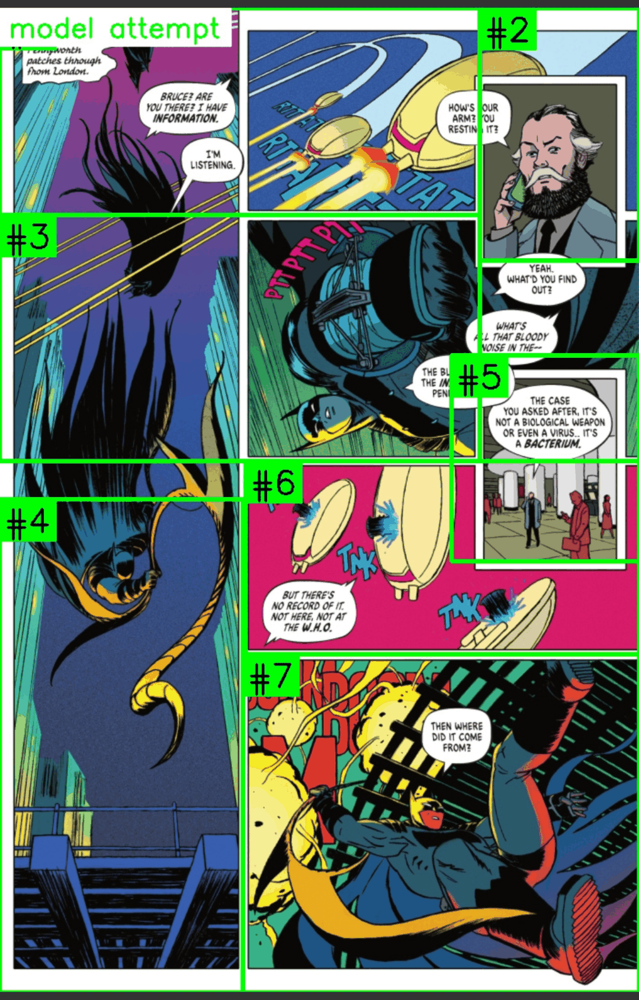

# From Cheap & Cheerful to Proper Harness: A Journey Building a Comic Panel Detector

I love reading comics. I buy a ton of them, and enjoy digital comics. Often I only have my phone on me, and it's really *the worst* for reading comics. I find it so annoying trying to zoom in on panels, rotate my phone, etc.

With GenAI (Gemini, my tool of choice), I'm always trying to think of new personal problems to solve. SmartyComics started as a "cheap and cheerful" experiment to see if a local script, whipped up with a pretrained YOLO model and some quick bounding box math, could preprocess standard comic archives (`.cbz`) to deliver a Comixology-grade Guided View experience - essentially, instead of flipping through pages, can I flip through *panels?*

**Why is this hard?**

Comic panels are typically rectangles, but modern comics are not grids. They are dynamic stories told in shapes, overlapping panels, borderless splashes, and inset flashbacks. Sometimes there are no shapes. Sometimes things don't read simply left to right, row by row.

Because this was for fun, I started out with basic prompts, guiding Gemini through the basics. I had this idea of plotting everything on a Pareto curve, and slowly built this up. I'm now at the point I want to move to something more rigorous and robust, especially with proper RLHF.

I wanted to document the history so far. This is a long post, but covers the history of this project as I start this blog. Subsequent posts will be shorter and more iterative.

## Learning about methods of detection and ordering

Comic panel detection and ordering is the core engine of reading flow. Over the course of the project, we traveled through three levels of algorithmic complexity to handle the chaos of comic layouts.

### Level 1: Z-Pattern Grid Sorting (The Baseline)

Our earliest baseline sorted bounding boxes by grouping them into horizontal rows using their vertical centers, and then sorting those rows from left to right.

- **The Good:** Safe and simple for standard grids.
  
- **The Bad:** Completely blind to inset panels, diagonal gutters, and complex modern layouts where panels flow vertically in sidebars before continuing horizontally.
  

### Level 2: Recursive XY-Cut

To improve sidebar handling, Gemini recommended and implemented a recursive XY-Cut algorithm. This algorithm scans the page horizontally and vertically for continuous white space (gutters) and recursively slices the page.

- **The Good:** Natively supports "Tall-Left, Two-Small-Right" layouts, a common panel layout where one large, vertical panel occupies the left side of the page (or a section of it), while two smaller, horizontally stacked panels occupy the right side. Visually, it looks like this:
  
  ```
  A | B
  A | C
  ```
  
- **The Bad:** Fails completely when panel borders overlap, or when ink bleeds or narrative captions bridge the gutters, causing massive, unreadable panel merges.
  



### Level 3: Vision-Language / Adjacency Relation Graph Sorter (The Semantic ARG Sorter)

To break the limits of simple geometry, we transitioned to a **Semantic ARG Sorter**. This engine models the page as a Directed Acyclic Graph (DAG) of narrative flow using interval shadow projections. Instead of looking for full-page cuts, it calculates topological precedence rules between neighboring panels (e.g., "does Panel A overlap Panel B in a way that suggests a top-to-bottom flow?").

**If this sounds complex, at this point I think I lost the plot a bit, which is one reason we are going to take a step back and implement something more rigorous.**

- **The Good:** Handles sidebars, overlaps, and inset layouts natively.
  
- **The Bad:** Highly sensitive to detection noise, necessitating the development of robust fallback logic to Z-pattern in case of cycles.
  

## How does it perform?

Here's the same page:



You can see how it's KIND OF almost there, but also at the same point, completely unusable.

I spent a lot of time doing manual reviews, giving Gemini the feedback, and asking for the improvements above. This was tedious, and of course, not really best practice. I needed something more rigorous that I could tune.

## Defining Quality: Accuracy vs. Aesthetic

As the sorting and CV engines grew more complex, I hit a scaling wall. How do you verify if a new heuristic tweak fixes a Batman comic without breaking a Wonder Woman layout? Every comic book has a different artist, and the artists are all amazing and pushing the envelope on layouts!

The answer was defining two distinct, quantitative quality metrics:

1. **Reading Accuracy (X-Axis):** Minimizing missed panels and text cutoffs. It measures if the reader gets to see all the content in the correct order.
  
2. **Reading Aesthetic (Y-Axis):** Minimizing panel merges and false positives. It measures how clean and polished the crops are (avoiding jagged borders or distracting overlaps). By tracking these two dimensions, we established our first quantitative "True North."
  

## Scaling the Judge: The VLM Sled

Even with clear metrics, manually grading hundreds of comic pages for every commit was impossible.

To solve this, we built a local **Evaluation Sled** powered by a Vision-Language Model (Gemini/Gemma) acting as an "Expert Judge". We feed the VLM the original page alongside the coordinates of our engine's panel detections. The VLM grades the attempt, flagging missed panels, text cutoffs, and panel merges, and stores the results locally in `ground_truth_cache.json`.

By caching these ground truths, we can instantly run local evaluations of our layout engine without making repeated network calls, creating a rapid, deterministic feedback loop.

But we didn't just want a passive judge; we wanted an **agent-in-the-loop** that could help the system *self-improve*. Alongside the quantitative grades, the VLM reports back specific insights and suggestions.

To make this possible without the AI constantly breaking Python syntax, we extracted every single magic number—confidence thresholds, gap tolerances, proximity limits—into a centralized `heuristics.toml` configuration file. This was a game-changer. It allowed us to clearly save and version-control "winning" configurations, and more importantly, it meant our AI agent could autonomously tweak thresholds and run new iterations without ever touching the core execution code.

## Our results so far

Because I hadn't been keeping the best records, we only have data from a few commits:

<div id="plotly-chart">
        <!-- You can fetch the 22KB HTML content dynamically or copy/paste it here -->
        <!-- Or use an object/embed tag: -->
        <object type="text/html" data="/charts/2026-06-07-from-cheap-cheerful-to-proper-smarty/progress_so_far.html" width="100%"
  height="600px"></object>
    </div>


Some nice properties:
  * Some comics we perform REALLY well on (80%+ accuracy), but there are some difficult comics that bring the average down.
  * We can see a Pareto frontier emerge (essentially, the versions of the engine where we couldn't improve accuracy any further without sacrificing visual aesthetic), which is just fun from a stats perspective. We see some runs that have the same accuracy but lower aesthetics than the 'best' run.

## What's Next: Getting serious about definitions, scoring, and tuning the Expert

This project started fast and loose, but it's ready to grow up. The next step is ensuring our VLM Judge is actually a reliable expert. I want to tidy up the code, make it easier to add algorithms, run test sleds, collect feedback, and maybe even use **RLHF (Reinforcement Learning from Human Feedback)** to align our AI grader's aesthetic and reading flow judgments with actual human readers.

Stay tuned!
